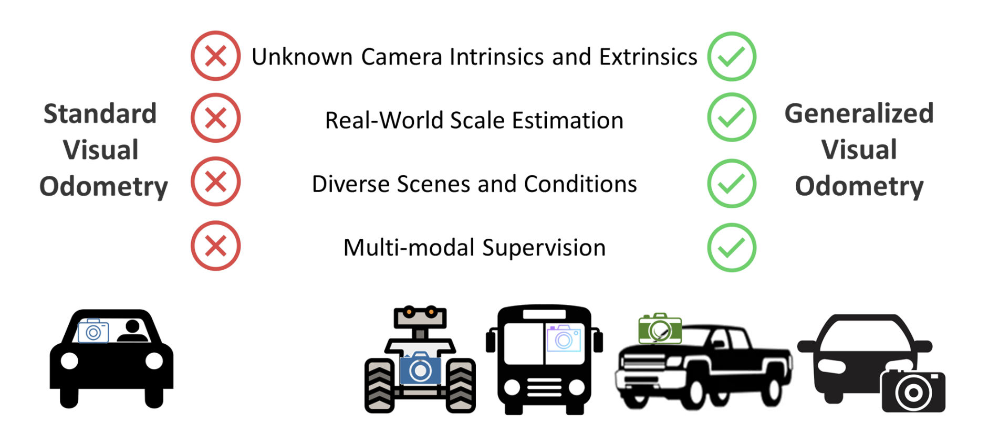
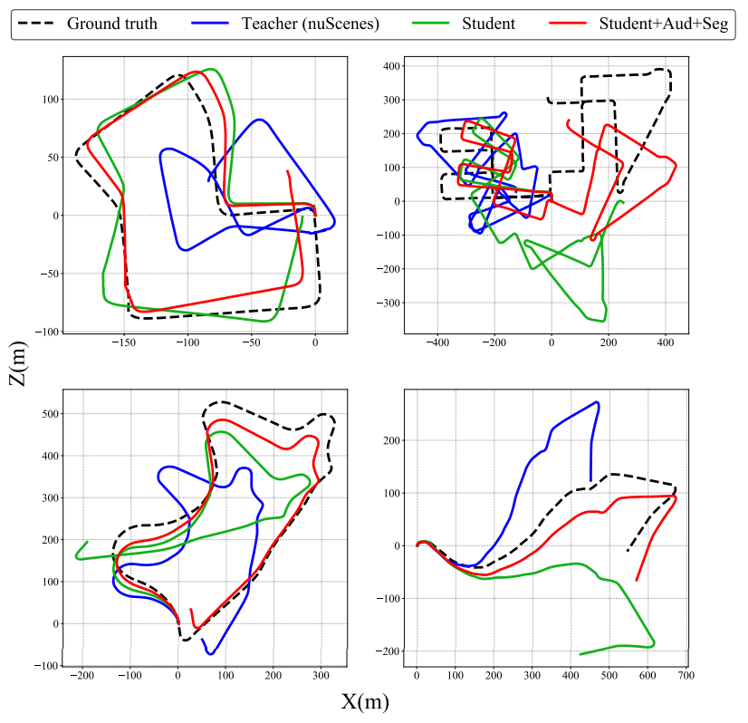

[![CC BY-NC-SA 4.0][cc-by-nc-sa-shield]][cc-by-nc-sa]  

[cc-by-nc-sa]: http://creativecommons.org/licenses/by-nc-sa/4.0/  
[cc-by-nc-sa-shield]: https://img.shields.io/badge/License-CC%20BY--NC--SA%204.0-lightgrey.svg  


# XVO: Generalized Visual Odometry via Cross-Modal Self-Training
This repository contains the code that accompanies our ICCV 2023 paper [XVO: Generalized Visual Odometry via Cross-Modal Self-Training](https://genxvo.github.io/resources/XVO.pdf). Please find our [project page](https://genxvo.github.io/) for more details. 

<p>
    
</p>  

### Overview  
We propose XVO, a semi-supervised learning method for training generalized monocular Visual Odometry (VO) models with robust off-the-self operation across diverse datasets and settings. Our XVO can efficiently learn to recover relative pose with real-world scale from visual scene semantics, i.e., without relying on any known camera parameters. Our key contribution is twofold. First, we empirically demonstrate the benefits of semi-supervised training for learning a general-purpose direct VO regression network. Second, we demonstrate multi-modal supervision, including segmentation, flow, depth, and audio auxiliary prediction tasks, to facilitate generalized representations for the VO task.   

### Dataset
We use KITTI, Argoverse 2 and nuScenes dataset along with in-the-wild YouTube videos. Please find their websites for dataset setup.  
| Datasets  | Download Link |
| ------------- | ------------- |
| KITTI  | The Argoverse 2 dataset can be downloaded from the official source [here](https://www.cvlibs.net/datasets/kitti/eval_odometry.php). All other datasets, after processing, will adhere to the same directory structure as the KITTI dataset.  |
| Argoverse 2  | The Argoverse 2 dataset can be downloaded from the official source [here](https://www.argoverse.org/av2.html#download-link). Once downloaded, the subset corresponding to the VO task can be extracted using the provided script located in the [data](https://github.com/h2xlab/XVO/tree/main/data) directory.  |
| nuScenes  | The nuScenes dataset can be downloaded from the official source [here](https://www.nuscenes.org/nuscenes#download). Once downloaded, the subset corresponding to the VO task can be extracted using the provided script located in the [data](https://github.com/h2xlab/XVO/tree/main/data) directory.  |
| YouTube  | Approximately 30 hours of driving footage were selected from videos published on the YouTube channel youtube.com/@jutah, featuring a diverse range of driving scenarios. A more comprehensive list of driving videos from YouTube can be found [here](https://docs.google.com/spreadsheets/d/1bHWWP_VXeEe5UzIG-QgKFBdH7mNlSC4GFSJkEhFnt2I/edit?gid=0#gid=0).|

The directory structure within the [data](https://github.com/h2xlab/XVO/tree/main/data) folder is organized as follows:
```bash
data/ 
├── KITTI/
│    ├── sequences/ 
│    └── poses/
├── Argoverse 2/
│    ├── sequences/ 
│    └── poses/
└── nuScenes/
    ├── segmentations/ 
    ├── sequences/ 
    └── poses/
```
The nuScenes dataset requires segmentation labels to support the cross-modal self-training process. Precomputed segmentations are available [here](https://drive.google.com/drive/folders/1sOhguNCihWHrPNlCexHyUe_grgaNcQF8?usp=sharing). Alternatively, users may regenerate the segmentation annotations using recent state-of-the-art segmentation models.

### Environment Requirements and Installation
```bash
# create a new environment
conda create -n XVO python=3.9
conda activate XVO
# install pytorch
conda install pytorch==2.0.1 torchvision==0.15.2 torchaudio==2.0.2 pytorch-cuda=11.7 -c pytorch -c nvidia
conda install -c iopath iopath
# install pytorch3d
wget https://anaconda.org/pytorch3d/pytorch3d/0.7.5/download/linux-64/pytorch3d-0.7.5-py39_cu117_pyt201.tar.bz2
conda install pytorch3d-0.7.5-py39_cu117_pyt201.tar.bz2
sudo rm pytorch3d-0.7.5-py39_cu117_pyt201.tar.bz2
# export CUDA 11.7 
export CUDA_HOME=/usr/local/cuda-11.7
export PATH=$CUDA_HOME/bin:$PATH
export LD_LIBRARY_PATH=$CUDA_HOME/lib64:$LD_LIBRARY_PATH
pip install PyYAML==6.0.2 timm==1.0.16 matplotlib==3.5.3 pandas==2.3.0 opencv-python==4.11.0.86 a-unet==0.0.16 mmcv-full==1.7.2 numpy==1.26.4 pillow==11.0.0 av2==0.2.1 nuscenes-devkit==1.1.11
```

## Training 
1. **Install the correlation package**  
    The correlation package must be installed first:
    ```
    cd model/correlation_package
    python setup.py install
    ```
2. **Preprocess the dataset**  
    The labels are available in the [poses](https://github.com/h2xlab/XVO/tree/main/poses) directory. To regenerate the labels or review the corresponding implementation details, please refer to the code and execute the following command:
    ```
    python3 preprocess.py
    ```
3. **Download initial weights**

    Download initial weights to [init_weights](https://github.com/h2xlab/XVO/tree/main/init_weights) directory. Initial weights can be found [here](https://drive.google.com/drive/folders/16v0U2RoRay7miYKb7LebKlXqZAe0d2tg?usp=sharing).
4. **Run training**

    Supervised Training on KITTI:
    ```
    # update params.py
    self.train_video = {'KITTI': ['00', '02', '08', '09'],}
    self.multi_modal = False
    self.checkpoint_path = 'saved_models/xvo_kitti_sl'
    ```

    Cross-Modal Self-Training on nuScenes and YouTube:
    ```
    # update params.py
    self.train_video = {
        'NUSC': nusc_scene_map['singapore-hollandvillage'],
        'YouTube': ['00', '01', '02', '03', '04', '05', '06', '07', '08', '09', '10', '11'],
        }
    self.multi_modal = True
    self.checkpoint_path = 'saved_models/xvo_nusc_ytb_ssl'
    ```
    and run:
    ```
    python3 main.py
    ```
## Test

Supervised Training on KITTI, we test on the rest of KIITI sequences:
```
# update test_utils.py
par.multi_modal = False
par.checkpoint_path = "saved_models/xvo_kitti_sl"
par.test_video = {'KITTI': {'KITTI': ['03', '04', '05', '06', '07', '10']}}
```

Cross-Modal Self-Training on nuScenes and YouTube:
```
# update test_utils.py
par.multi_modal = False
par.checkpoint_path = "saved_models/xvo_nusc_ytb_ssl"
# Evaluate the model sequentially on each of these datasets.
# par.test_video = {'ARGO2': {'ARGO2': [str(i).zfill(3) for i in range(150)]}}
# par.test_video = {'NUSC': {'NUSC': nusc_scene_map['boston-seaport']+nusc_scene_map['singapore-queenstown']+nusc_scene_map['singapore-onenorth']}}
# par.test_video = {'KITTI': {'KITTI': ['00', '01', '02', '03', '04', '05', '06', '07', '08', '09', '10']}}
```
and run:
```
python3 test_utils.py
```

## Evaluation
Dwonload model checkpoints to [saved_models](https://github.com/h2xlab/XVO/tree/main/saved_models) directory. Model checkpoints can be found [here].
```
python3 test.py
cd vo-eval-tool
python3 eval_odom.py
```
VO evaluation tool is revised from https://github.com/Huangying-Zhan/kitti-odom-eval.

## Result   
We find that incorporating audio and segmentation tasks as part of the semi-supervised learning process significantly improves ego-pose estimation on KITTI.   
<p>
      
</p>   

## Contact  
If you have any questions or comments, please feel free to contact us at leilai@bu.edu or sgzk@bu.edu.

## License  
Our work is licensed under a [Creative Commons Attribution-NonCommercial-ShareAlike 4.0 International License][cc-by-nc-sa].  

## ToDos  
- [X] Test code release
- [ ] Training code release
- [ ] Readme Update
