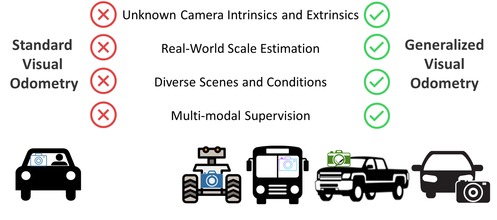
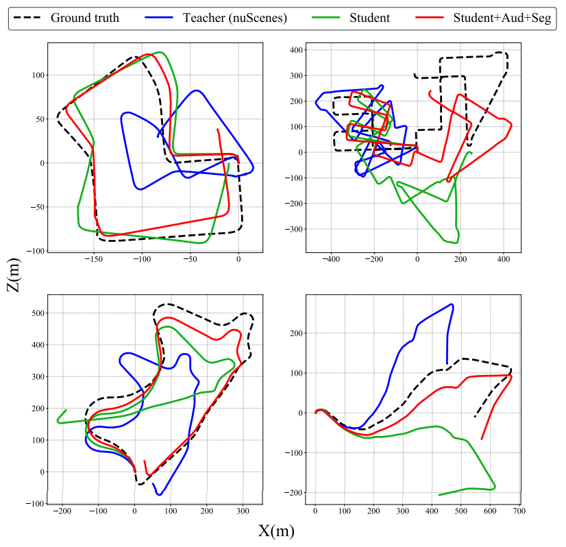

[![CC BY-NC-SA 4.0][cc-by-nc-sa-shield]][cc-by-nc-sa]  

[cc-by-nc-sa]: http://creativecommons.org/licenses/by-nc-sa/4.0/  
[cc-by-nc-sa-shield]: https://img.shields.io/badge/License-CC%20BY--NC--SA%204.0-lightgrey.svg  


# XVO: Generalized Visual Odometry via Cross-Modal Self-Training
This repository contains the code that accompanies our ICCV 2023 paper [XVO: Generalized Visual Odometry via Cross-Modal Self-Training](https://genxvo.github.io/resources/XVO.pdf). Please find our [project page](https://genxvo.github.io/) for more details. 

<p>
    
</p>  

### Overview  
We propose XVO, a semi-supervised learning method for training generalized monocular Visual Odometry (VO) models with robust off-the-self operation across diverse datasets and settings. Our XVO can efficiently learn to recover relative pose with real-world scale from visual scene semantics, i.e., without relying on any known camera parameters. Our key contribution is twofold. First, we empirically demonstrate the benefits of semi-supervised training for learning a general-purpose direct VO regression network. Second, we demonstrate multi-modal supervision, including segmentation, flow, depth, and audio auxiliary prediction tasks, to facilitate generalized representations for the VO task.   

### Dataset
We use KITTI, Argoverse 2 and nuScenes dataset along with in-the-wild YouTube videos (available soon). Please find their websites for dataset setup.  
| Dataset  | Download Link |
| ------------- | ------------- |
| KITTI  | [Link](https://www.cvlibs.net/datasets/kitti/eval_odometry.php)  |
| Argoverse 2  | [Link](https://www.argoverse.org/av2.html#download-link)  |
| nuScenes  | [Link](https://www.nuscenes.org/nuscenes#download)  |
| YouTube  | Available Soon |

### Environment Requirements and Installation
```bash
# create a new environment
conda create --name xvo python=3.9
conda activate xvo

# install pytorch1.13.1
conda install pytorch==1.13.1 torchvision==0.14.1 torchaudio==0.13.1 -c pytorch

# install other requirements
pip install -r requirements.txt
```

## Training 
```
python main.py
```
The model will be saved to 

## Inference
```
python infer.py
```

## Evaluation
```
python test.py
```

## Result   
We abbreviate 'intrinsics-free' as I (i.e., a method which does not assume the intrinsics) and 'real-world scale' as S (i.e., a method is able to recover real-world scale). To ensure meaningful comparison, we categorize models based on supervision type. Firstly, we present unsupervised learning methods, followed by supervised learning methods, then generalized VO methods, and finally our XVO ablation. In the case of TartanVO, we analyze robustness to noise applied to the intrinsics. We train two teacher models: one based on KITTI (as shown in supervised learning approaches) and the other on nuScenes (as displayed at the end of the Table with ablations).  
<p>
      
</p>  

We find that incorporating audio and segmentation tasks as part of the semi-supervised learning process significantly improves ego-pose estimation on KITTI.   
<p>
      
</p>   

## Contact  
Please don't hesitate to contact us if you have any remarks or questions at leilai@bu.edu or sgzk@bu.edu. 

## License  
Our work is licensed under a [Creative Commons Attribution-NonCommercial-ShareAlike 4.0 International License][cc-by-nc-sa].  

## ToDos  
- [X] Training code release
- [ ] Readme Update


